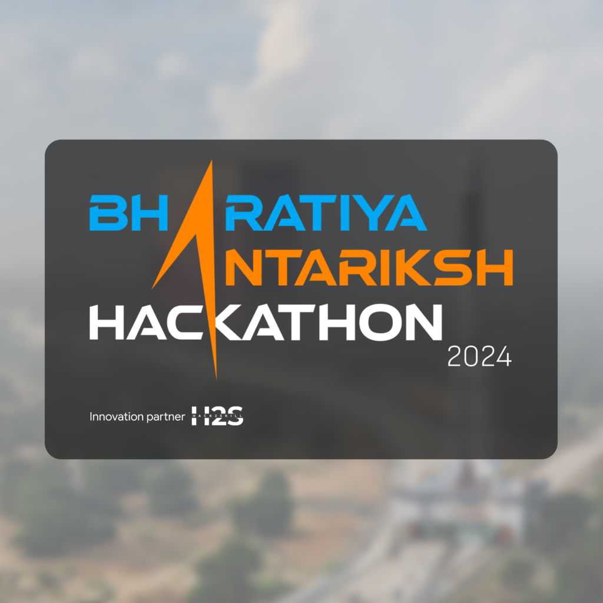

  
  

  ISRO Bharatiya Antariksha Hackathon 2024 | Problem Statement: 3 | Team Name: CCXP3 Asada (A)

## Problem statement
Automatic detection of craters and boulders from Orbiter High Resolution Camera(OHRC) images using AI/ML techniques
